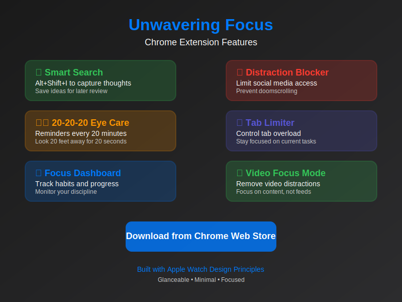
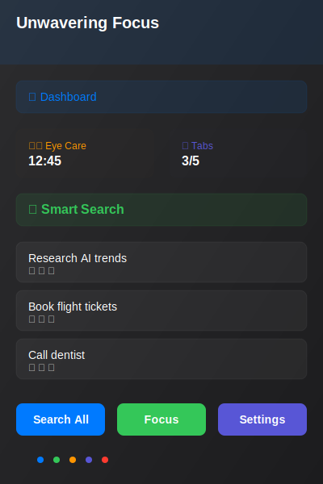
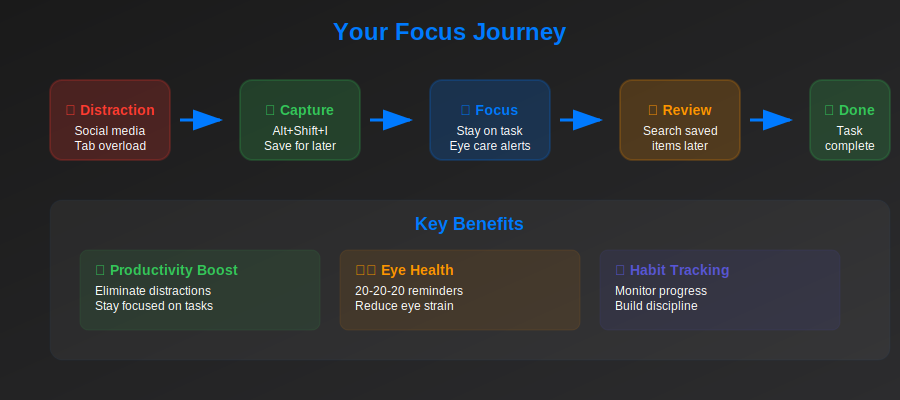

# 🎯 Unwavering Focus

> **Transform your browsing into focused productivity with the ultimate Chrome extension for eliminating digital distractions and building disciplined habits.**

[](https://chrome.google.com/webstore/detail/unwavering-focus/your-extension-id)
[](https://github.com/yourusername/unwavering-focus/releases)
[](LICENSE)

---

## 🚀 Why Unwavering Focus?

In today's digital world, distractions are everywhere. Social media feeds, endless tabs, and constant notifications pull us away from what truly matters. **Unwavering Focus** is your digital companion that transforms scattered browsing into purposeful productivity.

### ✨ What Makes Us Different

- **🎯 Smart Thought Capture**: Never lose an idea again with one-key capture (`Alt+Shift+I`)
- **🚫 Intelligent Distraction Blocking**: Limit social media access while allowing specific content
- **👁️ Eye Health Protection**: 20-20-20 reminders to prevent digital eye strain
- **📑 Tab Management**: Prevent tab overload and stay focused on current tasks
- **📊 Habit Tracking**: Build discipline with daily habit monitoring
- **🎬 Video Focus Mode**: Remove distractions from video platforms
- **⚡ Apple Watch Design**: Glanceable, minimal interface for instant comprehension



---

## 🎯 Core Features

### 🎯 Smart Search & Thought Capture
**Keyboard Shortcut: `Alt+Shift+I`**

Capture thoughts, ideas, and tasks instantly without breaking your flow. Selected text automatically populates the input field, and everything is saved for later review.

- **One-key capture** - Never lose an idea again
- **Auto-populate** from selected text
- **Search all** saved items at once
- **Copy to clipboard** with one click
- **Auto-remove** after searching

> 💡 **Pro Tip**: Free users can save up to 10 items. Pro users get unlimited storage for capturing every idea that comes to mind.

### 🚫 Distraction Blocker
Take control of your social media consumption with intelligent blocking that allows specific content while limiting homepage access.

- **Daily limits** for distracting domains
- **Content exceptions** - access specific videos/posts
- **Focus page redirect** when limits are reached
- **Customizable** domain lists
- **Overlay warnings** before blocking

> 💡 **Pro Tip**: Free users can block up to 3 domains. Pro users get unlimited distraction blocking for complete focus control.

### 👁️ 20-20-20 Eye Care
Protect your eyes with automatic reminders following the 20-20-20 rule: every 20 minutes, look 20 feet away for 20 seconds.

- **Automatic timers** while browsing
- **Audio cues** for reminders
- **Configurable** sound and volume
- **Visual notifications** in extension popup
- **Break completion** alerts

> 💡 **Pro Tip**: Free users get basic reminders. Pro users unlock custom sounds, haptic feedback, and advanced eye care analytics.

### 📑 Tab Limiter
Prevent tab overload and maintain focus on current tasks with intelligent tab management.

- **Configurable limits** (1-10 tabs)
- **Domain exclusions** for work tools
- **Smart alerts** when limit reached
- **Quick actions** to close tabs
- **Visual indicators** in popup

> 💡 **Pro Tip**: Free users are limited to 5 tabs. Pro users get unlimited tab management with advanced exclusion rules.

### 📊 Focus Dashboard
Track your progress and build discipline with a comprehensive habit tracking system.

- **Daily habit monitoring** with quick status updates
- **Mastery score** calculation
- **Motivational messages** based on performance
- **Pillar habit tracking** for long-term goals
- **Progress visualization**

> 💡 **Pro Tip**: Free users get basic habit tracking. Pro users unlock advanced analytics, streak tracking, and personalized insights.

### 🎬 Video Focus Mode
Remove distractions from video platforms while keeping the content you need.

- **YouTube distraction removal**
- **Netflix, Twitch, and more** support
- **Customizable** element hiding
- **Focus on content** not feeds
- **Preserve functionality** while removing noise

> 💡 **Pro Tip**: Free users get basic video focus. Pro users unlock advanced customization and support for all video platforms.

---

## 🎨 User Interface

Built with **Apple Watch Design Principles** for optimal glanceability and minimal interaction.



### Design Philosophy
- **Glanceable**: Get all information in 2-3 seconds
- **Minimal**: 80% content reduction for essential info only
- **Focused**: Single-tap interactions, no nested menus
- **Responsive**: Fast animations under 300ms
- **Accessible**: Respects motion preferences and screen readers

---

## 🔄 How It Works



### Your Focus Journey

1. **🚫 Identify Distraction** - Social media, tab overload, notifications
2. **🎯 Capture Thought** - Press `Alt+Shift+I` to save for later
3. **⚡ Stay Focused** - Continue with your current task
4. **📋 Review Later** - Search saved items when ready
5. **✅ Complete Tasks** - Build momentum and discipline

---

## 🚀 Quick Start

### Installation
1. **Download** from the [Chrome Web Store](https://chrome.google.com/webstore/detail/unwavering-focus/your-extension-id)
2. **Click "Add to Chrome"** to install the extension
3. **Pin the extension** to your toolbar for easy access
4. **Configure settings** by clicking the extension icon

### Start Free, Upgrade When Ready
Unwavering Focus offers a generous free tier to help you experience the benefits of focused browsing. As your productivity needs grow, you can unlock unlimited features with our Pro plan.

**Free Tier Includes:**
- Smart Search (10 items)
- Distraction Blocker (3 domains)
- Basic Eye Care reminders
- Tab Limiter (5 tabs)
- Essential habit tracking

**Pro Features Unlock:**
- Unlimited Smart Search storage
- Unlimited distraction blocking
- Advanced eye care with custom sounds
- Unlimited tab management
- Advanced analytics and insights
- Priority support

### First Steps
1. **Press `Alt+Shift+I`** to capture your first thought
2. **Set up distraction blocking** in Settings → Blocker
3. **Configure eye care reminders** in Settings → Care
4. **Set tab limits** in Settings → Focus
5. **Define your habits** in Settings → Habits

### Keyboard Shortcuts
- **`Alt+Shift+I`** - Open Smart Search modal
- **`Alt+Shift+F`** - Open Focus Dashboard
- **`Alt+Shift+S`** - Open Settings

---

## ⚙️ Configuration

### Smart Search Settings
- Enable/disable auto-remove after search
- Configure maximum saved items (default: 100)
- Customize keyboard shortcuts

### Distraction Blocker
- Add/remove distracting domains
- Set daily homepage limits per domain
- Configure content exception patterns
- Enable/disable overlay warnings

### Eye Care
- Enable/disable 20-20-20 reminders
- Adjust sound volume (0.0-1.0)
- Test audio cues
- Configure reminder intervals

### Tab Limiter
- Set maximum tabs (1-10)
- Add domain/subdomain exclusions
- Configure alert behavior
- Enable/disable automatic blocking

### Focus Dashboard
- Define pillar habits (3-5 recommended)
- Set motivational messages
- Configure mastery score thresholds
- Reset daily counters

---

## 💰 Value Proposition

**Time is your most valuable asset.** Unwavering Focus helps you reclaim 80-155 minutes daily by eliminating digital distractions and building focused habits.

**Monthly Value Created:**
- **Time savings:** 40-77.5 hours/month
- **Focus improvement:** Measurable productivity gains
- **Health benefits:** Reduced eye strain and stress
- **Professional growth:** Consistent habit formation

*That's €313-606 in value created monthly, making Unwavering Focus Pro an investment in your productivity and well-being.*

## 🎯 Use Cases

### For Students
- **Capture research ideas** during study sessions
- **Block social media** during exam prep
- **Track study habits** and consistency
- **Maintain focus** during online classes

### For Professionals
- **Save meeting notes** and action items
- **Limit work distractions** during deep work
- **Track productivity habits** and goals
- **Manage multiple project tabs**

### For Content Creators
- **Capture inspiration** without breaking flow
- **Focus on video content** without distractions
- **Track creative habits** and consistency
- **Maintain workflow** across platforms

### For Remote Workers
- **Separate work and personal** browsing
- **Maintain focus** in distracting environments
- **Track work habits** and productivity
- **Protect eye health** during long sessions

---

## 💎 Pricing & Plans

Unwavering Focus is designed to grow with you. Start with our generous free tier and upgrade when you're ready to unlock your full productivity potential.

### Free Plan
**Perfect for getting started**
- Smart Search (10 items)
- Distraction Blocker (3 domains)
- Basic Eye Care reminders
- Tab Limiter (5 tabs)
- Essential habit tracking

### Pro Plan
**For serious productivity seekers**
- **€8.99/month** or **€89.99/year** (save 17%)
- Unlimited Smart Search storage
- Unlimited distraction blocking
- Advanced eye care with custom sounds
- Unlimited tab management
- Advanced analytics and insights
- Video focus mode
- Priority support

### Lifetime
**One-time investment**
- **€199** for lifetime access
- All Pro features forever
- Future updates included
- Break-even in 22 months

*Choose the plan that fits your productivity journey.*

## 🔧 Technical Details

### Built With
- **React 18** - Modern UI components
- **TypeScript** - Type-safe development
- **Chrome Extension Manifest V3** - Latest standards
- **Tailwind CSS** - Utility-first styling
- **Webpack** - Efficient bundling

### Architecture
- **Clean Architecture** - Separation of concerns
- **Apple Watch Design** - Glanceable interfaces
- **Emil Kowalski Animations** - Natural, fast motion
- **Bulletproof Focus System** - Reliable user interaction

### Performance
- **Lightweight** - Minimal resource usage
- **Fast animations** - Under 300ms for responsiveness
- **Efficient storage** - Chrome storage optimization
- **Hardware acceleration** - GPU-optimized animations

---

## 🤝 Contributing

We welcome contributions! Please see our [Contributing Guidelines](CONTRIBUTING.md) for details.

### Development Setup
```bash
# Clone the repository
git clone https://github.com/yourusername/unwavering-focus.git
cd unwavering-focus

# Install dependencies
npm install

# Start development server
npm run dev

# Build for production
npm run build

# Run linting
npm run lint

# Format code
npm run format
```

### Project Structure
```
src/
├── components/          # React components
│   ├── popup/          # Extension popup UI
│   ├── ui/             # Reusable UI components
│   └── metrics/        # Dashboard metrics
├── services/           # Business logic
├── hooks/              # Custom React hooks
├── constants/          # App constants
├── types/              # TypeScript definitions
└── utils/              # Utility functions
```

---

## 📊 Roadmap

### Version 1.1 (Coming Soon)
- [ ] **Custom element hiding** for any website
- [ ] **Advanced analytics** and insights
- [ ] **Cloud sync** for settings and data
- [ ] **Mobile companion app**

### Version 1.2
- [ ] **Team collaboration** features
- [ ] **Advanced habit tracking** with streaks
- [ ] **Integration** with productivity tools
- [ ] **Custom themes** and personalization

### Version 2.0
- [ ] **AI-powered** distraction detection
- [ ] **Cross-platform** support (Firefox, Safari)
- [ ] **Advanced analytics** dashboard
- [ ] **API integration** with external services

---

## 🆘 Support

### Getting Help
- **📖 [Documentation](https://docs.unwaveringfocus.com)** - Complete user guide
- **🐛 [Report Issues](https://github.com/yourusername/unwavering-focus/issues)** - Bug reports and feature requests
- **💬 [Discussions](https://github.com/yourusername/unwavering-focus/discussions)** - Community support
- **📧 [Email Support](mailto:support@unwaveringfocus.com)** - Direct support

### Common Issues
- **Extension not working?** Check if it's enabled in Chrome settings
- **Keyboard shortcuts not working?** Ensure no conflicts with other extensions
- **Settings not saving?** Check Chrome storage permissions
- **Performance issues?** Try disabling other extensions temporarily

---

## 📄 License

This project is licensed under the MIT License - see the [LICENSE](LICENSE) file for details.

---

## 🙏 Acknowledgments

- **Apple Watch Design Team** - For inspiration on glanceable interfaces
- **Emil Kowalski** - For animation principles and best practices
- **Chrome Extension Community** - For development guidance and support
- **Our Users** - For feedback and continuous improvement

---

## 🌟 Star History

[](https://star-history.com/#yourusername/unwavering-focus&Date)

---

<div align="center">

**Ready to reclaim your focus and productivity?**

[](https://chrome.google.com/webstore/detail/unwavering-focus/your-extension-id)

*Join thousands of users who have already transformed their digital habits. Start free, upgrade when you're ready.*

</div>

---

<div align="center">

**Made with ❤️ for focused productivity**

[Website](https://unwaveringfocus.com) • [Documentation](https://docs.unwaveringfocus.com) • [Support](https://github.com/yourusername/unwavering-focus/discussions)

</div> 